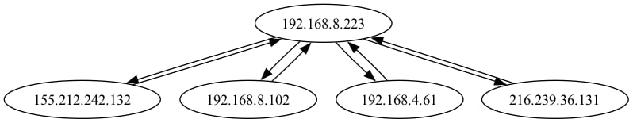
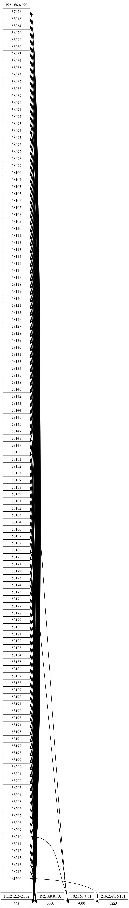

## 1. Начинаем
Загружаю в wireshark, ничего непонятно, с стартуем с каких-то запросов с 192.168.8.223, поэтому проверим не наш ли это основной сетевой интерфейс c помощью фильтра:

ip.src != 192.168.8.223 and ip.dst != 192.168.8.223

Отлично: 192.168.8.223 наш IP

## 2. Понимаем куда ходили
Пишем простой питонячий скрипт, чтобы посмотреть что у нас вообще в сети (начнем с TCP):

## 3. Отлично, то есть получаем:
* 155.212.242.132:443 - это наш VPN;

* 216.239.36.131:5223 - немного утелки (какие-то пуши или RCS сообщения)
https://macadmin.fraserhess.com/2024/12/05/corporate-firewall-rule-for-rcs-on-ios/

* 192.168.8.102:7000;192.168.4.61:7000 - что-то в локальной сети, разумно, что траффик и не должен через VPN идти;
## 4. Теперь посмотрим на UDP

Выглядит страшно, но тут видим, что очень много идет в наш VPN, смотрим что пошло мимо:
* 91.108.0.0\16 - это Telegram, и он идет мимо VPN

* 224.0.0.251 - DNS (локальный DNS, а почему не через VPN тоже?)
Проверяем в wireshark что спрашивали: _ws.col.protocol == MDNS

	Спрашивали:

	- googlecast

	- spotify-connect

* 239.255.255.250:1900 - девайсы в локальной сети

* 77.125.38.24:49273 - это айпишник израильского провайдера. Может через них делают звонки-сообщения на определенных приложениях, мало ли у них там договоренностей с гигантами
https://www.whois.com/whois/77.125.38.24

https://en.wikipedia.org/wiki/Partner_Communications_Company

https://en.wikipedia.org/wiki/Internet_Gold_Golden_Lines

* 157.240.196.62:3478 - dig говорит, что edgeray-shv-02-mrs2.facebook.com (ага, фейсбук)
https://gist.github.com/vinloo/5f15c7742ae2beef8681b057230ebef6

	Похоже это общая проблема iOS судя по всему:

	https://protonvpn.com/blog/apple-ios-vulnerability-disclosure/

	https://www.michaelhorowitz.com/VPNs.on.iOS.are.scam.php#wherestands

	Решение:
	В ios приложении включить флаг includeAllNetworks.

	https://developer.apple.com/documentation/networkextension/nevpnprotocol/includeallnetworks

## 5. Так, смотрим includeAllNetworks:
The system always excludes the following network traffic from the tunnel regardless of this property value:

* Network control plane traffic that maintains a device’s connection to the local network, such as DHCP.

* Captive portal negotiation traffic that authorizes a device with a Wi-Fi hotspot.

* Certain cellular services traffic that uses the cellular network only, such as VoLTE.

* Traffic that communicates with a companion device, such as an Apple Watch.

Вот статья, где обсуждают как обходят: https://mullvad.net/en/blog/why-we-still-dont-use-includeallnetworks

## 6. Итак, выявленные утечки:

Проблема в том, что iOS не заворачивает весь траффик в VPN.

## 7. Как зачинить?

Пробуем включить includeAllNetworks в приложении, но не панацея.

И копаем в направлении из https://mullvad.net/en/blog/why-we-still-dont-use-includeallnetworks
